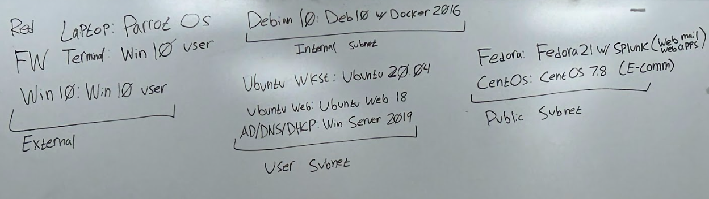

# 9/09/2025 Minutes 

### Machines Currently are running: 
- 4 machines are currently running Fedora 5.13
- 1 running Ubuntu
- 1 running Windows 8 
- 2 are locked
    Will need to clean and wipe them. 

- All machines work

Docker does not need own computer and be placed with debian
The topology will need to be updated. 

### Action Items
- Set up cables and labeled some of the work stations. 
- Got call to api to work.
- Got Windows 10 ready for install.

